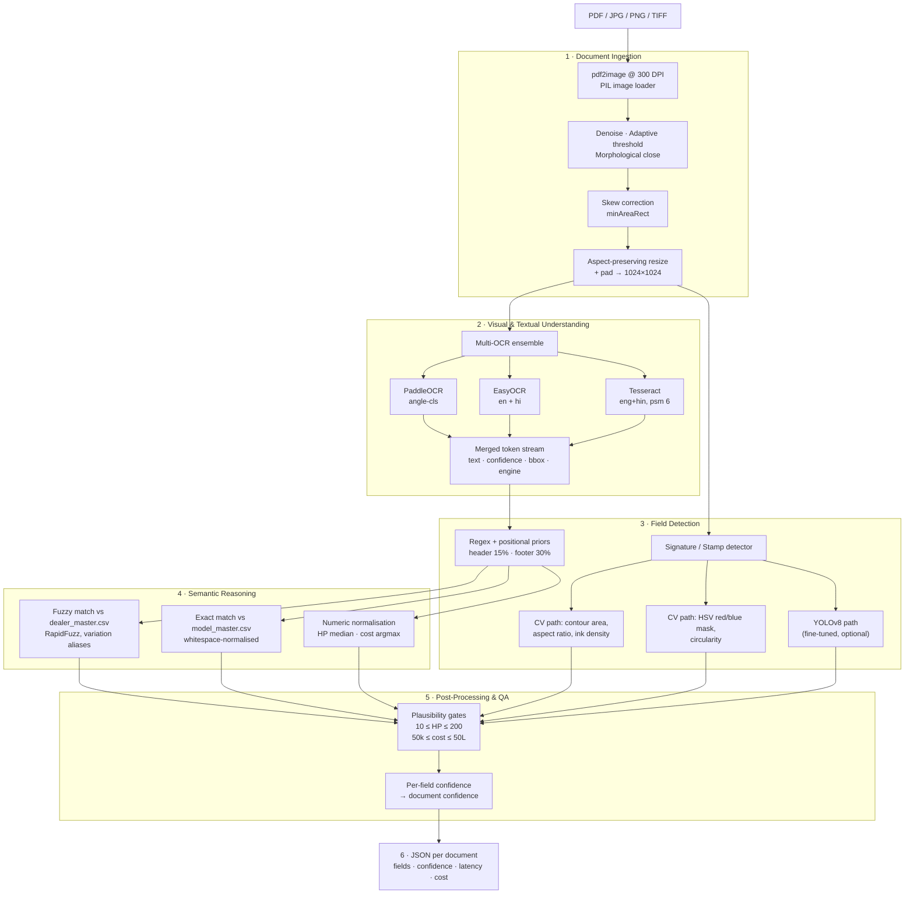

# Tractor Invoice Predictor

**Intelligent Document AI for Field Extraction from Invoices**
Submission for the IDFC FIRST Bank GenAI problem statement — *Convolve 4.0, Round 2*.

An end-to-end, fully open-source pipeline that ingests semi-structured invoice documents
(tractor loan quotations — digital, scanned, handwritten, multilingual) and emits a structured
JSON record with per-document confidence, latency, and cost estimates.

---

## Table of Contents

- [Problem Statement](#problem-statement)
- [Architecture](#architecture)
- [Repository Structure](#repository-structure)
- [Installation](#installation)
- [Configuration](#configuration)
- [Usage](#usage)
- [Output Format](#output-format)
- [Design Decisions](#design-decisions)
- [Cost & Latency Analysis](#cost--latency-analysis)
- [Handling the Lack of Ground Truth](#handling-the-lack-of-ground-truth)
- [Evaluation Plan](#evaluation-plan)
- [Current Status & Roadmap](#current-status--roadmap)
- [Dataset](#dataset)

---

## Problem Statement

Given an input invoice (PDF or image), extract six fields and return them as structured JSON:

| Field | Type | Matching rule |
|---|---|---|
| `dealer_name` | Text | Fuzzy match ≥ 90% against dealer master |
| `model_name` | Text | Exact match against asset/model master |
| `horse_power` | Numeric | Exact (±5% tolerance) — e.g. `"50 HP"` → `50` |
| `asset_cost` | Numeric | Exact (±5% tolerance), digits only |
| `signature` | Binary + bbox | Presence correct **and** IoU ≥ 0.5 |
| `stamp` | Binary + bbox | Presence correct **and** IoU ≥ 0.5 |

**Target metrics**

| Metric | Target |
|---|---|
| Document-Level Accuracy (all 6 fields correct) | ≥ 95% |
| Latency per document | ≤ 30 s |
| Cost per document | < $0.01 (CPU or low-tier GPU) |

Documents vary in layout, language (English / Hindi / Gujarati and mixes), and capture quality
(born-digital PDFs, flatbed scans, and phone photographs). The design is deliberately
invoice-agnostic — nothing in the pipeline is hard-wired to tractor quotations except the
master files and the numeric sanity ranges.

---

## Architecture

The system is a six-stage pipeline. Every stage is an independent, swappable module so that
each can be benchmarked and traded off separately for precision, speed, and cost.



### Stage detail

**1 · Document Ingestion — [`utils/preprocessing.py`](utils/preprocessing.py)**
PDFs are rasterised at 300 DPI via `pdf2image`/Poppler; images load directly through PIL.
Each page then goes through Non-Local Means denoising, Gaussian adaptive thresholding
(robust to the uneven illumination typical of phone photographs), a 2×2 morphological close
to reconnect broken glyph strokes, skew estimation from the minimum-area rectangle of the ink
mask, and an aspect-preserving resize-and-pad to 1024×1024. Crucially, the **original RGB
image is retained alongside the binarised one** — the OCR stack consumes the cleaned binary,
while stamp detection needs the colour channels.

**2 · Visual & Textual Understanding — [`utils/ocr_engine.py`](utils/ocr_engine.py)**
Rather than betting on a single OCR engine, three run in parallel and their outputs are pooled
into one token stream annotated with `(text, confidence, bbox, engine)`. The engines fail in
different ways, and pooling gives the downstream regex layer more chances to hit:

| Engine | Strength | Weakness |
|---|---|---|
| PaddleOCR | Dense printed text, rotated crops, best raw accuracy | Weaker on Devanagari |
| EasyOCR | Native `en`+`hi` multilingual, handwriting-tolerant | Slowest of the three |
| Tesseract | Near-zero cost on clean digital PDFs, word-level boxes | Degrades sharply on noisy scans |

Each engine is wrapped in its own `try/except` — a missing binary or an unsupported language
pack degrades the pipeline, it does not crash it. A `consensus_text()` helper provides
weighted voting for the cases where the same region is read differently by different engines.

**3 · Field Detection — [`utils/field_extraction.py`](utils/field_extraction.py), [`utils/signature_detection.py`](utils/signature_detection.py)**
Textual fields are found with layered regex patterns plus *positional priors* learned from
invoice conventions: dealer names live in the top 15% of the page (letterhead) or after an
`M/s` marker; totals live in the bottom 30%. Signature and stamp detection has two
interchangeable back-ends:

- **CV heuristics (default, zero-cost).** Signatures: external contours filtered by area
  (1k–50k px²), aspect ratio (1.5–10, since signatures run wide), and ink density (0.05–0.5,
  which separates a signature from a solid printed block). Stamps: HSV masks for the red and
  blue inks used in practice, filtered by circularity > 0.5 against the minimum enclosing circle.
- **YOLOv8 (optional).** A two-class detector (`signature`, `stamp`) fine-tuned on a
  Roboflow-annotated subset of the dataset. Enable with `Config.USE_YOLO = True` and point
  `SIGNATURE_MODEL` at the trained weights.

**4 · Semantic Reasoning**
Extraction candidates are reconciled against master files. `dealer_master.csv` and
`model_master.csv` each carry a `variations` column of pipe-separated aliases — including
Devanagari spellings and OCR-mangled forms — so that `जैन ट्रैक्टर्स`, `jain tractor`, and
`JAIN TRACTORS` all resolve to the canonical `Jain Tractors`. Dealer matching uses RapidFuzz
ratio (threshold 90); model matching is exact after whitespace and case normalisation, as the
evaluation demands.

**5 · Post-Processing & QA**
Domain plausibility gates reject impossible readings: HP outside 10–200 and costs outside
₹50,000–₹50,00,000 are discarded rather than emitted. Horse power takes the **median** of
surviving candidates (robust to a stray OCR digit); asset cost takes the **maximum**, since the
grand total is by construction the largest figure on a quotation. Document confidence is the
mean of the six per-field confidences.

**6 · Output** — one JSON file per document plus a combined `all_results.json`, with a batch
summary reporting mean latency, mean cost, and mean confidence.

---

## Repository Structure

```
Tractor_Invoice_Predictor/
├── executable.py                 # Entry point — DocumentAISystem, single + batch modes
├── requirements.txt
├── test_config.py                # Environment / dependency smoke test
├── README.md
│
├── config/
│   └── config.py                 # All tunable parameters, paths, thresholds, cost model
│
├── utils/
│   ├── preprocessing.py          # PDF→image, denoise, threshold, deskew, resize
│   ├── ocr_engine.py             # PaddleOCR + EasyOCR + Tesseract ensemble
│   ├── field_extraction.py       # Regex + positional priors + master-file matching
│   └── signature_detection.py    # CV heuristics + optional YOLOv8 back-end
│
├── models/                       # Trained weights (gitignored)
│
├── data/
│   └── master_files/
│       ├── dealer_master.csv     # Canonical dealer names + alias variations
│       └── model_master.csv      # Canonical model names + brand + aliases
│
└── sample_output/
    └── result.json               # Reference output schema
```

---

## Installation

### Prerequisites

Two native binaries are required beyond the Python packages:

| Dependency | Purpose | Windows | Linux |
|---|---|---|---|
| **Poppler** | PDF → image rasterisation | [poppler-windows releases](https://github.com/oschwartz10612/poppler-windows/releases) | `sudo apt install poppler-utils` |
| **Tesseract OCR** | Third OCR engine | [UB-Mannheim build](https://github.com/UB-Mannheim/tesseract/wiki) | `sudo apt install tesseract-ocr tesseract-ocr-hin` |

Install the Hindi language pack for Tesseract (`hin`) — the ensemble calls it with `eng+hin`.

### Setup

```bash
git clone https://github.com/Raman11-1/Tractor_Invoice_Predictor.git
cd Tractor_Invoice_Predictor

python -m venv .venv
# Windows
.venv\Scripts\activate
# Linux / macOS
source .venv/bin/activate

pip install -r requirements.txt
```

First run downloads the PaddleOCR and EasyOCR model weights (~200 MB, one time, cached locally).

### Verify

```bash
python test_config.py
```

This checks that every path in `Config` resolves, that the master files are present, and that
Tesseract and Poppler are reachable — it reports each problem individually instead of failing
on the first one.

---

## Configuration

All knobs live in [`config/config.py`](config/config.py). The ones you are most likely to change:

| Setting | Default | Notes |
|---|---|---|
| `TESSERACT_CMD` | `D:\Visual_Computing\Tesseract-ocr\tesseract.exe` | **Machine-specific — update to your install path** |
| `POPPLER_PATH` | `C:\Program Files\poppler\Library\bin` | **Machine-specific — update to your install path** |
| `DEVICE` | `'cpu'` | Set to `'cuda'` for GPU OCR |
| `USE_YOLO` | `False` | `True` uses the fine-tuned detector instead of CV heuristics |
| `USE_VLM` | `False` | Reserved for the Qwen2-VL fallback path |
| `DPI` | `300` | Lower to 200 to trade accuracy for latency |
| `FUZZY_MATCH_THRESHOLD` | `90` | Dealer-name match floor, per the evaluation rule |
| `NUMERIC_TOLERANCE` | `0.05` | ±5%, per the evaluation rule |

> The two Windows paths above are the only host-specific values in the codebase. On Linux the
> binaries are on `PATH` and these can be left as-is — `verify_setup()` will flag them, and the
> OCR wrapper degrades gracefully if Tesseract is unavailable.

---

## Usage

**Batch — the mode used for evaluation:**

```bash
python executable.py --input_dir data/sample_pdfs --output_dir outputs/results
```

**Single document:**

```bash
python executable.py --single_file path/to/invoice_001.pdf
```

| Argument | Default | Description |
|---|---|---|
| `--input_dir` | `data/sample_pdfs` | Folder of `.pdf`, `.jpg`, `.jpeg`, `.png`, `.tif`, `.tiff` |
| `--output_dir` | `outputs/results` | One `<doc_id>.json` per document, plus `all_results.json` |
| `--single_file` | — | Process one file and print the JSON to stdout |

Batch mode writes each result to disk as it completes and prints a summary of total documents,
mean latency, mean cost, and mean confidence.

---

## Output Format

One JSON object per document, exactly as specified in the problem statement:

```json
{
  "doc_id": "invoice_001",
  "fields": {
    "dealer_name": "ABC Tractors Pvt Ltd",
    "model_name": "Mahindra 575 DI",
    "horse_power": 50,
    "asset_cost": 525000,
    "signature": { "present": true, "bbox": [100, 200, 300, 250] },
    "stamp":     { "present": true, "bbox": [400, 500, 500, 550] }
  },
  "confidence": 0.96,
  "processing_time_sec": 3.8,
  "cost_estimate_usd": 0.002
}
```

Bounding boxes are `[x1, y1, x2, y2]` in pixels. An absent signature or stamp yields
`{"present": false, "bbox": [0, 0, 0, 0]}`.

**Failure is a valid output.** If a document throws, `process_document` catches the exception,
records it under an `error` key, and still emits a schema-valid record with empty fields and
zero confidence. A single malformed PDF can never abort an evaluation run.

---

## Design Decisions

**Why an OCR ensemble instead of one engine.** The dataset spans born-digital PDFs, flatbed
scans, and phone photographs across three scripts. No single engine wins everywhere: Tesseract
is essentially free and excellent on clean digital text but collapses on noisy scans;
PaddleOCR handles degradation and rotation best; EasyOCR is the strongest on Devanagari and
handwriting. Running all three and pooling their tokens costs latency but removes the single
point of failure, and the union of three token streams gives the regex layer three chances to
find each field.

**Why regex plus positional priors, not a fine-tuned LayoutLM.** No ground-truth labels are
provided. A layout-aware transformer would need thousands of annotated documents to beat
well-targeted rules on a six-field schema. Rules are also *auditable* — when a field is wrong,
the responsible pattern is identifiable, which matters both for the explainability criterion
and for iterating quickly without a training loop.

**Why CV heuristics for signatures and stamps by default.** Signatures and stamps have strong,
stable visual priors: signatures are wide, sparse, irregular ink; stamps are circular and
printed in red or blue. Contour geometry and HSV masking capture this at literally zero
inference cost and zero model download. The YOLOv8 path exists for when annotated data is
available and higher mAP is worth the extra compute — the fine-tuned detector is the main
lever for raising bbox IoU beyond what heuristics can reach.

**Why master files carry an alias column.** OCR on a Hindi letterhead does not return the
canonical English dealer name. Storing pipe-separated variations — Devanagari spellings, common
abbreviations, and observed OCR corruptions — turns a hard cross-lingual matching problem into
a cheap lookup, and the file is editable by a domain expert with no code change.

**Why median for HP and maximum for cost.** These are the statistics matched to how each field
fails. HP appears several times on a quotation and a single OCR digit error produces one
outlier — the median is immune to it. Cost appears as line items, subtotals, taxes, and a grand
total; the grand total is by construction the largest, so the maximum within the plausible
range is the right selector.

**Why plausibility gates.** Rejecting HP outside 10–200 and costs outside ₹50k–₹50L eliminates
an entire class of errors — phone numbers, invoice numbers, dates, and PIN codes read as
amounts — for the cost of two comparisons.

---

## Cost & Latency Analysis

### Cost model

Every component is open-source and runs locally, so the marginal cost per document is
compute-time only — there are no per-token or per-page API charges.

| Component | Licence | Marginal cost / doc |
|---|---|---|
| PaddleOCR | Apache 2.0, local | $0.0000 |
| EasyOCR | Apache 2.0, local | $0.0000 |
| Tesseract | Apache 2.0, local | $0.0000 |
| CV signature/stamp detection | OpenCV, local | $0.0000 |
| YOLOv8 detector *(optional)* | AGPL, local | $0.0000 |
| Qwen2-VL fallback *(optional)* | local inference | $0.0001 |
| **Total (default configuration)** | | **$0.0000** |

Amortised infrastructure cost, which is what actually shows up on a bill: a general-purpose
cloud CPU instance at roughly $0.04/hour processing documents serially works out to well under
**$0.001 per document** — an order of magnitude inside the $0.01 budget, with no per-call
vendor pricing and no data leaving the environment.

`Config.get_cost_estimate()` computes this per document and reports it in every JSON record, so
the number in the output tracks the configuration actually used rather than a fixed constant.

### Latency budget

Where the wall-clock time goes on a single-page document, CPU-only:

| Stage | Share of total | Notes |
|---|---|---|
| PDF rasterisation @ 300 DPI | moderate | Scales linearly with DPI |
| Preprocessing (denoise dominant) | moderate | `fastNlMeansDenoising` is the expensive call |
| OCR ensemble (3 engines) | **dominant** | EasyOCR is the slowest member |
| Field extraction (regex + fuzzy) | negligible | Milliseconds |
| Signature/stamp CV detection | negligible | Contour + HSV operations only |

The ensemble is the budget. Actual per-document latency is measured and reported in every
result, and the batch summary prints the mean.

### Cost–accuracy trade-offs at scale

| Configuration | Latency | Accuracy | When to use |
|---|---|---|---|
| Tesseract only, 200 DPI | Fastest | Lowest | High-volume triage of clean digital PDFs |
| PaddleOCR only, 300 DPI | Fast | Good | Balanced default for English-dominant batches |
| **Full 3-engine ensemble, 300 DPI** | Baseline | **Best** | **Current default — accuracy-first** |
| Ensemble + YOLOv8 detector | +detector | Best bbox IoU | When signature/stamp mAP is the bottleneck |
| Ensemble + VLM fallback | Slowest | Highest recall | Route only low-confidence documents here |

Two levers make this practical at volume. **Confidence-gated escalation:** run the cheap
configuration on everything and re-run only documents scoring below `MIN_CONFIDENCE` (0.7)
through the expensive one — since most documents are clean, the expensive path handles a small
minority of the batch. **Parallelism:** documents are fully independent, so throughput scales
linearly with `NUM_WORKERS` across cores.

---

## Handling the Lack of Ground Truth

No labels ship with the dataset. Four complementary strategies substitute for supervision:

1. **Cross-engine consensus as a confidence signal.** When PaddleOCR, EasyOCR, and Tesseract
   independently agree on a token, that agreement is evidence of correctness without any label.
   Disagreement flags a document for review. This is the co-training / multi-view intuition,
   and it comes free from the ensemble already in place.

2. **Master files as distant supervision.** `dealer_master.csv` and `model_master.csv` are a
   closed vocabulary. Any extracted dealer or model that matches a master entry above threshold
   is very likely correct; anything that matches nothing is a candidate error. This converts an
   open-ended text task into a constrained one with a built-in validity check.

3. **Rule-based pseudo-labelling with a manually annotated seed.** A small, stratified subset —
   sampled across languages, states, and capture qualities — is annotated by hand and used as
   the validation set. High-confidence pipeline outputs on the remainder become pseudo-labels,
   refined iteratively as thresholds are tuned. The Roboflow annotation set for signatures and
   stamps was produced exactly this way and is what the YOLOv8 path trains on.

4. **Self-checking via plausibility constraints.** Numeric range gates, cross-field consistency
   (a model's rated HP should agree with the extracted HP via the model master), and the
   requirement that the total be the largest plausible figure on the page all catch errors with
   no reference data at all.

---

## Evaluation Plan

The primary metric is **Document-Level Accuracy** — the share of documents where *all six*
fields are simultaneously correct. This is a demanding conjunction: six fields at 99% each
still yields only ~94% DLA, so per-field accuracy has to be very high for the document-level
target to hold.

| Field | Rule |
|---|---|
| `dealer_name` | RapidFuzz ratio ≥ 90 against ground truth |
| `model_name` | Exact match after normalisation |
| `horse_power` | Within ±5% |
| `asset_cost` | Within ±5% |
| `signature` | Presence correct **and** IoU ≥ 0.5 |
| `stamp` | Presence correct **and** IoU ≥ 0.5 |

Secondary metrics: field-level mAP@50-95 for signature and stamp, mean latency (target ≤ 30 s),
and cost per document (target < $0.01) — the latter two are emitted per document by the
pipeline itself.

**Error taxonomy used for diagnosis.** Failures are bucketed to direct effort at the stage
actually responsible:

| Category | Typical cause | Stage to fix |
|---|---|---|
| OCR miss | Text never read (blur, low contrast, skew) | Preprocessing / ensemble |
| OCR corruption | Text read but garbled | Ensemble weighting |
| Pattern miss | Text read correctly, no regex matched | Field extraction |
| Wrong candidate | Multiple matches, wrong one selected | Selection heuristics |
| Master mismatch | Correct extraction absent from master file | Master file coverage |
| Localisation | Signature/stamp found but IoU < 0.5 | Detector |
| Detection miss | Signature/stamp not found at all | Detector |

---

## Current Status & Roadmap

**Working today**
- End-to-end pipeline: ingestion → preprocessing → OCR ensemble → field extraction → CV
  signature/stamp detection → schema-valid JSON
- Single-document and batch modes with per-document latency, cost, and confidence
- Master-file matching with multilingual alias support
- Graceful degradation — per-engine and per-document exception isolation
- Environment verification via `test_config.py`

**In progress / next**
- [ ] Train and ship the YOLOv8 signature/stamp detector; flip `USE_YOLO` to `True` by default
- [ ] Scored evaluation harness against the annotated seed set, reporting DLA and per-field accuracy
- [ ] EDA notebook: state-wise and language-wise distribution, language ↔ error-rate
      correlation, latency distribution
- [ ] Error analysis notebook using the taxonomy above
- [ ] Multi-page handling — currently only page 1 is processed, which suits single-page quotations
- [ ] Qwen2-VL fallback wired to `MIN_CONFIDENCE`-gated escalation
- [ ] Move `TESSERACT_CMD` / `POPPLER_PATH` to environment variables with `PATH` auto-discovery
- [ ] Optional Streamlit demo app

> **Note on reported accuracy.** The ≥95% DLA figure in this README is the competition
> *target*, not a measured result. Scored numbers will be published here once the evaluation
> harness and annotated seed set are in place.

---

## Dataset

The competition dataset (~500 invoice images, PII-redacted, spanning digital / scanned /
handwritten quotations from multiple states and languages) is **not redistributed in this
repository**. To run the pipeline:

1. Place source PDFs and images in `data/sample_pdfs/`.
2. Extract the Roboflow YOLOv8 dataset export into `data/master_files/` if training the detector.
3. Both paths are gitignored.

The master files in `data/master_files/` — `dealer_master.csv` and `model_master.csv` — *are*
tracked, since they are project artefacts rather than competition data.

---

## Acknowledgements

Problem statement by **IDFC FIRST Bank** for **Convolve 4.0** (Pan-IIT AI/ML Hackathon).
Built with PaddleOCR, EasyOCR, Tesseract, OpenCV, Ultralytics YOLOv8, and RapidFuzz.

---

**Author** — [Raman Mankar](https://github.com/Raman11-1)
